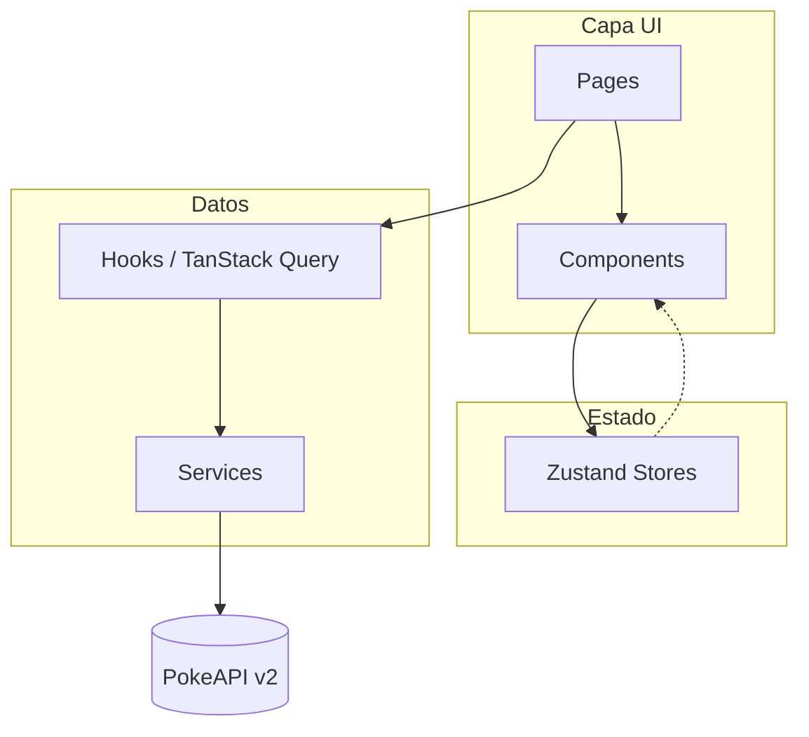

<div align="center">

<!-- Banner / Logo -->


# PokeDex Universe

**Explora, filtra y compara más de 1.000 Pokémon con una experiencia web moderna impulsada por PokeAPI.**

*Catálogo interactivo de nivel producción: no es un listado simple, es una plataforma de descubrimiento con datos reales, animaciones fluidas y arquitectura profesional.*

<br />

<!-- Badges Shields.io -->


<br />

[**Demo en vivo**](#-demo-en-vivo) · [**Instalación**](#️-instalación-y-configuración) · [**Arquitectura**](#-arquitectura-del-proyecto) · [**Reportar issue**](https://github.com/TU_USUARIO/pokedex-universe/issues)

</div>

---

## 📍 Tabla de Contenidos

- [🚀 Demo en Vivo](#-demo-en-vivo)
- [✨ Características](#-características)
- [📸 Capturas de Pantalla](#-capturas-de-pantalla)
- [🛠️ Stack Tecnológico](#️-stack-tecnológico)
- [🏗️ Arquitectura del Proyecto](#️-arquitectura-del-proyecto)
- [⚙️ Instalación y Configuración](#️-instalación-y-configuración)
- [📂 Estructura del Proyecto](#-estructura-del-proyecto)
- [🧪 Scripts Disponibles](#-scripts-disponibles)
- [☁️ Despliegue](#️-despliegue)
- [🤝 Contribuir](#-contribuir)
- [📄 Licencia](#-licencia)
- [👨‍💻 Autor](#-autor)

---

## 🚀 Demo en Vivo

> Sustituye la URL cuando despliegues en Vercel o Netlify.

<div align="center">

[](https://vercel.com/new)
[](https://app.netlify.com/start)

**🔗 [https://pokedex-universe.vercel.app](https://pokedex-universe.vercel.app)** *(enlace de ejemplo — actualízalo tras el deploy)*

</div>

### Requisitos de la demo

- Navegador moderno (Chrome, Firefox, Edge, Safari)
- Conexión a internet (datos desde [PokeAPI](https://pokeapi.co/))
- Sin API key ni registro

---

## ✨ Características

| | Funcionalidad | Descripción |
|---|----------------|-------------|
| 🔍 | **Catálogo inteligente** | Scroll infinito, búsqueda con debounce (300 ms) y filtros por tipo, generación y stats |
| 🎴 | **Tarjetas interactivas** | Flip 3D (frente / shiny + stats), prefetch al hover y skeleton loading |
| 📊 | **Detalle completo** | Radar de stats, cadena evolutiva, descripción en español, sprites normal/shiny |
| ⚖️ | **Comparador** | Hasta 4 Pokémon lado a lado con tabla diff y radar multicolor superpuesto |
| ❤️ | **Favoritos** | Persistencia en `localStorage`, exportación JSON y enlace compartible |
| 🫐 | **Bayas, objetos y movimientos** | Catálogos secundarios con detalle desde PokeAPI |
| 🌓 | **Modo claro / oscuro** | Tema con `class` strategy, respeta `prefers-color-scheme` |
| 📱 | **Totalmente responsivo** | Grid adaptable; filtros en sidebar (desktop) o apilados (móvil) |
| ⚡ | **Rendimiento** | Lazy routes, TanStack Query (cache 5 min), sin `fetch` en componentes UI |
| ♿ | **Accesibilidad** | `aria-label` en acciones, soporte `prefers-reduced-motion` |

---

## 📸 Capturas de Pantalla

> **Tip para GitHub:** Añade GIFs o PNG en `docs/screenshots/` y actualiza las rutas abajo.

<div align="center">

| Inicio | Catálogo | Detalle |
|:------:|:--------:|:-------:|
| *Home con búsqueda y tipos* | *Grid + filtros + infinite scroll* | *Stats, radar y evolución* |
| `docs/screenshots/home.png` | `docs/screenshots/catalog.png` | `docs/screenshots/detail.png` |

| Comparador | Modo oscuro | Tarjeta flip |
|:----------:|:-----------:|:------------:|
| *Radar 4 colores + tabla* | *Tema dark* | *Reverso shiny* |
| `docs/screenshots/compare.png` | `docs/screenshots/dark.png` | `docs/screenshots/flip.png` |

</div>

```bash
# Carpeta sugerida para tus assets del README
mkdir -p docs/screenshots
```

**GIF recomendado (~10 s):** navegación Home → Catálogo → filtro por tipo → flip de tarjeta → comparador.

---

## 🛠️ Stack Tecnológico

### Frontend

<p>


</p>

| Tecnología | Uso en el proyecto |
|------------|-------------------|
| **React 18** | UI declarativa y componentes por feature |
| **TypeScript** | Tipado estricto de modelos PokeAPI |
| **Vite 5** | Dev server y build estático optimizado |
| **React Router v6** | Rutas lazy-loaded con `Suspense` |
| **TanStack Query v5** | Data fetching, cache y prefetch |
| **Zustand** | Filtros, comparador, favoritos y tema |
| **Tailwind CSS 3** | Design system y modo oscuro |
| **Framer Motion** | Animaciones de entrada y transiciones |
| **Recharts** | Radar de estadísticas y comparador |
| **Vitest + RTL** | Base para pruebas unitarias |

### API y datos

<p>

</p>

| Recurso | Detalle |
|---------|---------|
| **[PokeAPI v2](https://pokeapi.co/docs/v2)** | REST pública, ~35 endpoints, sin autenticación |
| **Sprites GitHub** | Imágenes desde `raw.githubusercontent.com/PokeAPI/sprites` |

### DevOps / Cloud (objetivo de deploy)

<p>


</p>

| Plataforma | Rol |
|------------|-----|
| **Vercel / Netlify** | Hosting de `dist/` (SPA estática) |
| **GitHub Actions** *(opcional)* | CI: `lint` + `build` en cada PR |

---

## 🏗️ Arquitectura del Proyecto

Arquitectura **feature-based** en capas: las vistas no llaman a la API directamente.



### Flujo de datos

1. **Pages** — Componen UI; sin lógica de negocio ni `fetch`.
2. **Components** — Presentacionales; reciben props y emiten eventos.
3. **Hooks** — Encapsulan queries (`useInfiniteQuery`, `useQuery`) con `staleTime: 5 min`.
4. **Services** — Funciones puras que construyen URLs y transforman respuestas.
5. **Stores** — Filtros, comparador (máx. 4), favoritos (`persist`) y tema UI.

### Rutas principales

| Ruta | Página |
|------|--------|
| `/` | Home — hero, autocompletado, destacados |
| `/catalog` | Catálogo con filtros e infinite scroll |
| `/pokemon/:id` | Detalle completo |
| `/compare` | Comparador multicolor |
| `/favorites` | Favoritos persistentes |
| `/berries` · `/items` · `/moves` | Catálogos secundarios |

---

## ⚙️ Instalación y Configuración

### Prerrequisitos

- **Node.js** ≥ 18
- **npm** ≥ 9 (o pnpm / yarn)

### 1. Clonar el repositorio

```bash
git clone https://github.com/TU_USUARIO/pokedex-universe.git
cd pokedex-universe
```

### 2. Instalar dependencias

```bash
npm install
```

### 3. Variables de entorno

```bash
cp .env.example .env
```

| Variable | Descripción | Valor por defecto |
|----------|-------------|-------------------|
| `VITE_POKEAPI_BASE_URL` | Base de la API | `https://pokeapi.co/api/v2` |
| `VITE_POKEMON_SPRITES_URL` | Sprites oficiales | URL de GitHub PokeAPI/sprites |

### 4. Ejecutar en desarrollo

```bash
npm run dev
```

Abre **http://localhost:5173**

### 5. Build de producción

```bash
npm run build
npm run preview
```

---

## 📂 Estructura del Proyecto

```
pokedex-universe/
├── public/                 # Assets estáticos (favicon, pokeball.svg)
├── docs/
│   └── screenshots/        # Capturas y GIFs para el README
├── src/
│   ├── assets/
│   ├── components/
│   │   ├── shared/         # Button, Badge, SearchBar, StatBar...
│   │   ├── layout/         # Navbar, Footer, AppLayout
│   │   ├── pokemon/        # PokemonCard, StatsRadar, EvolutionTree...
│   │   └── filters/        # FilterPanel
│   ├── constants/          # API, tipos, generaciones
│   ├── hooks/              # TanStack Query hooks
│   ├── pages/              # Vistas por ruta
│   ├── routes/             # AppRouter (lazy loading)
│   ├── services/           # Capa PokeAPI
│   ├── store/              # Zustand (filter, compare, favorites, ui)
│   ├── types/              # Interfaces TypeScript
│   └── utils/              # formatters, cache, filtros
├── .env.example
├── .gitignore
├── package.json
├── tailwind.config.js
├── tsconfig.json
└── vite.config.ts
```

---

## 🧪 Scripts Disponibles

| Comando | Descripción |
|---------|-------------|
| `npm run dev` | Servidor de desarrollo Vite |
| `npm run build` | TypeScript check + build producción |
| `npm run preview` | Vista previa del build |
| `npm run lint` | ESLint |
| `npm run test` | Vitest |

---

## ☁️ Despliegue

### Vercel (recomendado)

1. Importa el repo en [vercel.com](https://vercel.com).
2. Framework preset: **Vite**.
3. Build command: `npm run build` · Output: `dist`.
4. Añade las variables de `.env.example` en el dashboard.

### Netlify

```toml
# netlify.toml (opcional)
[build]
  command = "npm run build"
  publish = "dist"

[[redirects]]
  from = "/*"
  to = "/index.html"
  status = 200
```

### Subir a GitHub (primera vez)

```bash
git init
git add .
git commit -m "feat: initial release PokeDex Universe v1.0"
git branch -M main
git remote add origin https://github.com/TU_USUARIO/pokedex-universe.git
git push -u origin main
```

> El `.gitignore` ya excluye `node_modules`, `dist`, `.env` y caches locales.

---

## 🤝 Contribuir

1. Haz fork del proyecto.
2. Crea una rama: `git checkout -b feature/mi-mejora`.
3. Commit: `git commit -m "feat: descripción clara"`.
4. Push y abre un Pull Request.

Ideas bienvenidas: virtualización del catálogo, tests E2E, i18n completo, persistencia de Query en IndexedDB.

---

## 📄 Licencia

Este proyecto está bajo la licencia **MIT**. Los datos y sprites pertenecen a **Nintendo / Game Freak / Creatures** y se consumen vía [PokeAPI](https://pokeapi.co/) con fines educativos.

---

## 👨‍💻 Autor

<table>
  <tr>
    <td>
      <strong>Cristofer Teodoro</strong><br />
      Desarrollador Full Stack <br /><br />
      <a href="https://github.com/Teo-information">GitHub</a> ·
      <a href="https://www.linkedin.com/in/cristofer-condor/">LinkedIn</a> ·
      <a href="teodorocondor03@gmail.com">Email</a>
    </td>
  </tr>
</table>

---

<div align="center">

Hecho con ❤️ y mucha PokéAPI

⭐ Si te sirvió el proyecto, deja una estrella en el repo

</div>
